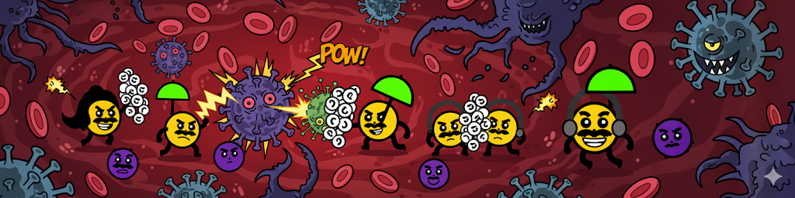

# The singleCellComic Game: An Interactive scRNA-seq Adventure



Welcome to the singleCellComic Game! This is an interactive Shiny application designed to teach the fundamental concepts of single-cell RNA sequencing (scRNA-seq) analysis through a fun, story-driven, and visual narrative.

## The Concept

The core idea of this game is to make abstract scRNA-seq data intuitive and memorable. We do this by translating complex concepts into a "Cell Comic" analogy:

* **Gene Expression** is represented by a cell's visual features (e.g., moustache size, hair style, headphones).
* **Cell Types** are unique characters defined by a combination of these features.
* **Bioinformatics Analyses** are steps in a 4-act story where you help solve a biological mystery.

This gamified approach guides users through a standard analysis workflow, explaining the *why* behind each step, from basic clustering to discovering novel cell subtypes.

## The Story in 4 Acts

The game is structured as a narrative journey:

* **Act 1: A Peaceful World** - Learn the basics of UMAP visualization and gene expression in a perfect, single-batch dataset.
* **Act 2: The Viral Invasion** - Encounter the critical problem of **batch effects** when combining data from two different sources and use the Harmony algorithm to solve it.
* **Act 3: The Reinforcements** - Use your corrected dataset as a reference to identify unknown cells using **label transfer**.
* **Act 4: The Lost Labels** - Perform **unsupervised clustering** to discover cell types from scratch and uncover hidden biological subtypes.

## Key Concepts Taught

* Dimensionality Reduction (UMAP)
* Visualizing Gene Expression (FeaturePlots, VlnPlots)
* Batch Effects
* Data Integration with Harmony
* Label Transfer / Reference Mapping
* Unsupervised Clustering
* Cluster Annotation & Subtype Discovery

## Technology Stack

This application is built entirely in R and powered by:

* **Shiny:** For the interactive web framework.
* **Seurat & Harmony:** For the core scRNA-seq analysis and data integration.
* **ggplot2 & patchwork:** For all data visualizations and creating the "Cell Comic" characters.
* **dplyr & purrr:** For data manipulation.
* **shinycssloaders:** For loading indicators during computation.

## How to Run the Game

### Prerequisites

* R (version 4.0 or newer)
* RStudio IDE (recommended)

### Installation

1.  **Clone the repository:**
    ```bash
    git clone [URL-to-your-repository]
    cd [repository-folder]
    ```

2.  **Install Required R Packages:**
    Excecute the `install_packages.R` script to install the required packages. 
	Alternatively, you can install them by running the following command in the R console:
    ```R
    install.packages(c("shiny", "shinycssloaders", "ggplot2", "dplyr", "patchwork", "Seurat", "harmony", "purrr", "tibble", "scales", "stringr", "ggforce", "circlize"))
    ```

3.  **File Structure:**
    Ensure your directory is structured correctly. The application expects the image file to be in a `www` subdirectory.
    ```
    /your-app-folder
    ├── cell_comic_game.R
    ├── functions.R
    ├── install_packages.R
    ├── README.md
    ├── LICENSE
    ├── /cache
    └── /www
        └── header_logo.png
    ```

### Launch the App

Open the `cell_comic_game.R` file in RStudio and click the "Run App" button in the top-right corner of the editor pane.

## Contact

This game was developed by Fabian Wu.

For questions, feedback, or collaborations, please reach out at [fabian.wu@novartis.com](mailto:fabian.wu@novartis.com).
